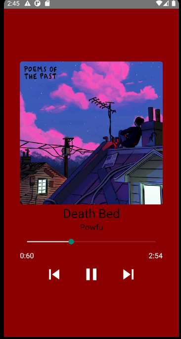

# react-native-app-mp3

Baseado no tutorial do youtube CreativeJE fazendo um app com react native que toca musicas, para rodar basta baixar as dependencias e instalar com npm install ou yarn add e npx react-native run-android se estive tuilizando android studio

